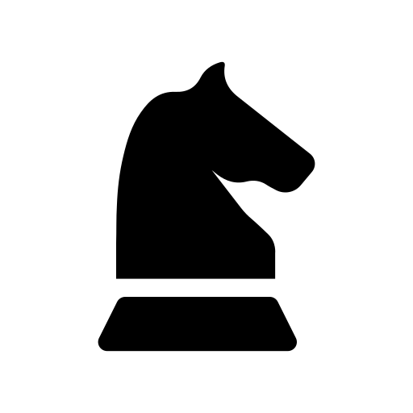

<!-- [![Contributors][contributors-shield]][contributors-url]
[![Forks][forks-shield]][forks-url]
[![Stargazers][stars-shield]][stars-url]
[![Issues][issues-shield]][issues-url]
[![project_license][license-shield]][license-url] -->

<!-- PROJECT LOGO -->
<br />
<div align="center">
  <a href="https://github.com/sandstorm831/chessdom">
    
  </a>

<h3 align="center">Chessdom</h3>

  <p align="center">
    Chessdom is an open-source web-based chess application.
    <br />
    <br />
    <a href="https://chessdom.vercel.app">View Demo</a>
    &middot;
    <a href="https://github.com/sandstorm831/chessdom/issues/new?labels=bug&template=bug-report---.md">Report Bug</a>
    &middot;
    <a href="https://github.com/sandstorm831/chessdom/issues/new?labels=enhancement&template=feature-request---.md">Request Feature</a>
  </p>
</div>

<!-- TABLE OF CONTENTS -->

## Table of Contents

  <ol>
    <li><a href="#about-the-project">About The Project</a></li>
    <li><a href="#prerequisites">Prerequisites</a></li>
    <li><a href="#built-with">Built with</a></li>
    <li><a href="#installation">Installation</a></li>
    <li><a href="#project-structure">Project structure</a></li>
    <li><a href="#note">Note</a></li>
    <li><a href="#license">License</a></li>
  </ol>

<!-- ABOUT THE PROJECT -->

## About The Project

[![Product Name Screen Shot][product-screenshot]](public/chessdom_knight.png)

Chessdom is an web-based chess application, whose name comes from combining `Chess` and `Wisdom`. Implemented two modes of gameplay in it, computer based gameplay where stockfish acts as your opponent and another is live gameplay where you can play chess with other fellow humans. Also build a game-archive with the name of `hall of games`, where each game which came to an valid end (resignation, check-mate or draw) in the live gameplay is stored.

### Built With

[![Next][Next.js]][Next-url]
[![React][React.js]][React-url]
[![Socket.IO][Socket.io]][Socket-url]
[![Prisma][prisma]][prisma-url]
[![TailWindCSS][tailwindcss]][tailwindcss-url]
[![NodeJS][nodejs]][nodejs-url]
[![TypeScript][typescript]][typescript-url]

## Prerequisites

To run the project in your local machine, you have to have the following packages

- Node.js : [Volta recommended](https://volta.sh/)

## Installation

Once you finish installation Node.js, follow the commands to setup the project locally on your machine

1. clone the project
   ```sh
   git clone https://github.com/Sandstorm831/chessdom.git
   ```
2. enter the project
   ```sh
   cd chessdom
   ```
3. Install NPM packages
   ```sh
   npm install
   ```
4. Create .env file at the root of the folder.
   ```sh
   touch .env
   ```
5. set up NextAuth Secret by running this command
   ```sh
   npx auth secret
   ```
6. Set the value of following OAuth variables in `.env.local` file created by the previous command

   ```
   AUTH_TRUST_HOST=true
   AUTH_GITHUB_ID=
   AUTH_GITHUB_SECRET=

   AUTH_GOOGLE_ID=
   AUTH_GOOGLE_SECRET=
   ```

   You can get the value of these variables from OAuth console of GitHub and Google, [read more](https://next-auth.js.org/)
   </br>

7. Setup the `DATABASE_URL` in `.env` file

   ```sh
   DATABASE_URL=
   ```

   You can get a hosted SQL database from Aiven
   <br/>

8. Run the development server:
   `sh
 npm run dev
 `
   This completes the set-up for this project, all the functionalities present in the application will now be live in your `dev server` except for live game-play for which you have to setup the [chess-socket server](https://github.com/sandstorm831/chessSocket)

<!-- LICENSE -->

## Project Structure

```
chessdom
┣ .next
┣ prisma                   // Contains DB Schema
┣ app
┃ ┣ (auth)
┃ ┃ ┣ auth
┃ ┃ ┃ ┗ signin
┃ ┃ ┃ ┃ ┗ page.tsx         // Custom SignIn page
┃ ┃ ┗ layout.tsx
┃ ┣ aboutme
┃ ┃ ┗ page.tsx             // AboutMe page
┃ ┣ api
┃ ┃ ┗ auth
┃ ┣ attribution
┃ ┃ ┗ page.tsx             // Attributions page
┃ ┣ dashboard
┃ ┃ ┣ chessboard
┃ ┃ ┃ ┗ page.tsx           // Complete stockfish gameplay code
┃ ┃ ┣ hallofgames
┃ ┃ ┃ ┣ dbqueries.ts
┃ ┃ ┃ ┗ page.tsx           // page for hall of games
┃ ┃ ┣ opponent
┃ ┃ ┃ ┗ page.tsx           // Complete live gameplay code
┃ ┃ ┣ reviewgame
┃ ┃ ┃ ┗ page.tsx           // Review game page
┃ ┃ ┗ page.tsx             // Dashboard page
┃ ┣ ui
┃ ┣ engineAndPGN.ts
┃ ┣ favicon.ico
┃ ┣ globals.css
┃ ┣ layout.tsx
┃ ┣ page.tsx               // root page
┃ ┣ socket.ts              // web-socket connection
┃ ┣ startEngine.ts         // Function for loading engine
┃ ┗ storeProvider.tsx      // Redux store provider
┃
┣ components
┃ ┣ ui                     // shadcn ui components
┃ ┣ auth_HOC.tsx           // route protecting HOC
┃ ┗ auth_components.tsx
┃
┣ hooks
┃ ┗ use-toast.ts           // shadcn toast component
┃
┣ lib
┃ ┣ features
┃ ┃ ┗ engine               // Redux slice folder
┃ ┣ hooks.ts               // Redux hooks
┃ ┣ store.ts               // Redux store generator
┃ ┗ utils.ts
┃
┣ public
┃ ┣ chesspeices            // chesspieces of gameplay
┃ ┣ images
┃ ┣ lib                    // Stockfish engine and
┃ ┃ ┃                      // engine loading scripts
┃ ┃ ┣ loadEngine.js
┃ ┃ ┣ stockfish.js
┃ ┃ ┣ stockfish.wasm
┃ ┃ ┗ stockfish.worker.js
┃ ┃
┃ ┣ sounds                 // Various sounds for gameplay
┃ ┣ chess.png
┃ ┣ chessdom_knight.png
┃ ┣ file.svg
┃ ┣ globe.svg
┃ ┣ knight.png
┃ ┣ knight_mirror.png
┃ ┣ knight_mirror_.png
┃ ┣ next.svg
┃ ┣ vercel.svg
┃ ┣ white_back_knight.png
┃ ┗ window.svg
┃
┣ stockfish                // Dormant stockfish folder
┃ ┣ stockfish              // Complete Stockfish 17 code folder
┃ ┃ ┣ src
┃ ┃ ┣ wiki
┃ ┃ ┣ AUTHORS
┃ ┃ ┣ CITATION.cff
┃ ┃ ┣ CONTRIBUTING.md
┃ ┃ ┣ Copying.txt
┃ ┃ ┣ README.md
┃ ┃ ┣ Top CPU Contributors.txt
┃ ┃ ┗ stockfish-ubuntu-x86-64-avx2
┃ ┃
┃ ┣ running.pid            // file containing running engine pid
┃ ┗ stockfish.ts           // Script to run stockfish on server
┃
┣ README.md
┣ auth.ts
┣ components.json
┣ eslint.config.mjs
┣ middleware.ts            // middleware for server side route
┃                          // protection
┣ next-env.d.ts
┣ next.config.ts           // File enforcing COEP and COOP
┣ package-lock.json
┣ package.json
┣ pnpm-lock.yaml
┣ postcss.config.mjs
┣ styles.txt               // contain font and color-palette
┣ tailwind.config.ts
┣ tsconfig.json
┗ tsconfig.tsbuildinfo
```

## Note

<ul>
<li>

#### Header allowances in Next Config

The engine will run in browsers with proper CORS headers applied. The following HTTP headers are required on top level response

```
Cross-Origin-Embedder-Policy: require-corp
Cross-Origin-Opener-Policy: same-origin
```

and following on included files

```
Cross-Origin-Embedder-Policy: require-corp
```

If top level headers are not configured properly, the `wasmThreadsSupported()` function as defined below will return `false`. If headers on included files are not configured correctly, something like `pthread sent an error! undefined:undefined: undefined` maybe logged to the console. You can read more about these headers [here](https://web.dev/articles/cross-origin-isolation-guide)

</li>

<li>

#### Stockfish Folder
Stockfish folder present in the root, is a dormant folder and doesn't help in any of the functionalities up untill current project scenario and removing the whole folder at once also will not have any impact in proper functioning of the project. It's kept because it can be moulded into added functionalities in future. The folder structure is as follows 
```
stockfish                // Dormant stockfish folder
┣ stockfish              // Complete Stockfish 17 code folder
┃ ┣ src
┃ ┣ wiki
┃ ┣ AUTHORS
┃ ┣ CITATION.cff
┃ ┣ CONTRIBUTING.md
┃ ┣ Copying.txt
┃ ┣ README.md
┃ ┣ Top CPU Contributors.txt
┃ ┗ stockfish-ubuntu-x86-64-avx2
┃
┣ running.pid            // file containing running engine pid
┗ stockfish.ts           // Script to run stockfish on server
```
The subfolder named `stockfish` contains the complete source code to run Stockfish 17 on a `linux` server. The `stockfish.ts` file contain the code to run the Stockfish 17 on server, execute stockfish commands, process best moves and information back to the client. The `running.pid` file will hold the PIDs of all the spawned Stockfish processes. This was initial approach to integrate stockfish with the client, but it faced the problem of scaling and delay, so this approach was abandoned for a client side Web-Assembly (.wasm) stockfish engine originally taken from [here](https://github.com/hi-ogawa/Stockfish). It can be the case in future that we might give an option for server side analysis, and so the reason for keeping the original files.
</li>

<li>

#### Detached Socket.IO server
The `play with a friend` option, will not work if the socket-io server is not setup. You can find the socket-io server [here](https://github.com/sandstorm831/chessSocket), going through the readme will be enought to setup the server.

</li>

</ul>

## License

Distributed under the GPL-3.0 license. See [License](./LICENSE) for more information.

<!-- MARKDOWN LINKS & IMAGES -->
<!-- https://www.markdownguide.org/basic-syntax/#reference-style-links -->

[contributors-shield]: https://img.shields.io/github/contributors/sandstorm831/chessdom.svg?style=for-the-badge
[contributors-url]: https://github.com/sandstorm831/chessdom/graphs/contributors
[forks-shield]: https://img.shields.io/github/forks/sandstorm831/chessdom.svg?style=for-the-badge
[forks-url]: https://github.com/sandstorm831/chessdom/network/members
[stars-shield]: https://img.shields.io/github/stars/sandstorm831/chessdom.svg?style=for-the-badge
[stars-url]: https://github.com/sandstorm831/chessdom/stargazers
[issues-shield]: https://img.shields.io/github/issues/sandstorm831/chessdom.svg?style=for-the-badge
[issues-url]: https://github.com/sandstorm831/chessdom/issues
[license-shield]: https://img.shields.io/github/license/sandstorm831/chessdom.svg?style=for-the-badge
[license-url]: https://github.com/sandstorm831/chessdom/blob/master/LICENSE.txt
[linkedin-shield]: https://img.shields.io/badge/-LinkedIn-black.svg?style=for-the-badge&logo=linkedin&colorB=555
[linkedin-url]: https://linkedin.com/in/linkedin_username
[product-screenshot]: public/chessdom_knight.png
[Next.js]: https://img.shields.io/badge/next.js-000000?style=for-the-badge&logo=nextdotjs&logoColor=white
[Next-url]: https://nextjs.org/
[React.js]: https://img.shields.io/badge/React-20232A?style=for-the-badge&logo=react&logoColor=61DAFB
[React-url]: https://reactjs.org/
[Socket.io]: https://img.shields.io/badge/Socket.io-black?style=for-the-badge&logo=socket.io&badgeColor=010101
[Socket-url]: https://socket.io/
[Socket-url]: https://socket.io/
[prisma]: https://img.shields.io/badge/Prisma-3982CE?style=for-the-badge&logo=Prisma&logoColor=white
[prisma-url]: https://www.prisma.io/
[tailwindcss]: https://img.shields.io/badge/tailwindcss-%2338B2AC.svg?style=for-the-badge&logo=tailwind-css&logoColor=white
[tailwindcss-url]: https://tailwindcss.com/
[nodejs]: https://img.shields.io/badge/node.js-6DA55F?style=for-the-badge&logo=node.js&logoColor=white
[nodejs-url]: https://nodejs.org/en
[typescript]: https://img.shields.io/badge/typescript-%23007ACC.svg?style=for-the-badge&logo=typescript&logoColor=white
[typescript-url]: https://www.typescriptlang.org/
